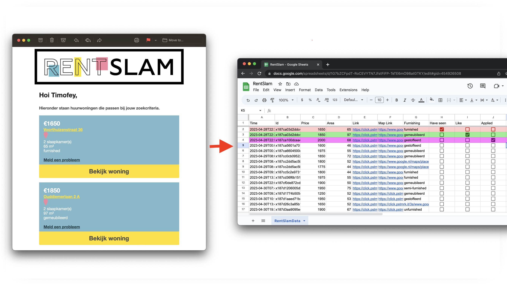

# RentSlamToGoogleSheets

Make your search for an apartment on https://rentslam.com a bit more manageable using the power of Google App Scripts and spreadsheets:

# How to use
1. Create a [Google sheet](https://sheets.google.com/)
2. Go to `Extensions -> App Script`
3. Copypaste code from [RentSlam.gs](RentSlam.gs) and run the `parseRentSlam` function
4. Run the script again if you get `Exceeded maximum execution time`

A sheet named `RentSlamData` should appear and start populating your spreadsheet.